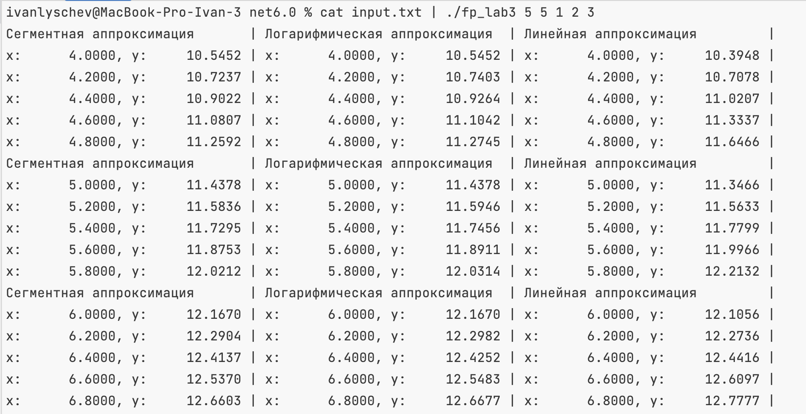

# Функциональное программирование
## Лабораторная работа 3

**Выполнил:** Лыщев Иван Антонович \
**Группа:** P34112 \
**Преподаватель:** Пенской Александр Владимирович

### Реализация
Функция читает из стандартного потока пока не будет пустая строка. 
В результате получаем список пар (x,y) 
```f#
let rec handleInput k (pList: (double * double) list) =
    let line = Console.ReadLine()

    if (not (isNull line) && line <> "") then
        let data = line.Split(";")

        if data.Length >= 2 && data[1] <> "" then
            let x = double data[0]
            let y = double data[1]

            match pList.Length with
            | 0 -> [ (x, y) ]
            | _ -> (x, y) :: List.truncate (k - 1) pList
        else
            handleInput k pList
    else
        pList

```
Полученный список точек обрабатывается, параллельно вычисляются функции, Печатается результат.\ 
Ожидается ввод новой пары чисел и алгоритм повторяется.
```f#
let rec processFuncsRec (funcIds: int[]) n k points =
    let newPoints = handleInput k points

    match newPoints with
    | pts when pts.Length = k && pts <> points ->
        let funcsArr =
            Seq.map (fun funcId -> (getFunc funcId newPoints)) funcIds
            |> Async.Parallel
            |> Async.RunSynchronously

        let pointGen = getPointGen n newPoints
        printValues (Array.zip funcsArr funcIds) pointGen n
        processFuncsRec funcIds n k newPoints
    | pts when pts <> points -> processFuncsRec funcIds n k newPoints
    | _ -> ()
```
В зависимости от аргументов командной строки, выбирается аппроксимирующая функция
```f#
let getFunc (funcId: int) points =
    async {
        match funcId with
        | 1 -> return segment points
        | 2 -> return logarifm points
        | _ -> return linear points
    }
```
Аппроксимация линейной функции. 
```f#
let linear points : double -> double =
    let sx = List.fold (fun state (x, _) -> state + x) 0. points
    let sxx = List.fold (fun state (x, _) -> state + x * x) 0. points
    let sy = List.fold (fun state (_, y) -> state + y) 0. points
    let sxy = List.fold (fun state (x, y) -> state + x * y) 0. points
    let n = points.Length
    let a = (sxy * (double n) - sx * sy) / (sxx * (double n) - sx * sx)
    let b = (sxx * sy - sx * sxy) / (sxx * (double n) - sx * sx)
    let f x = a * x + b
    f
```
Аппроксимация отрезками.
```f#
let segment (points: list<double * double>) : double -> double =
    let rec findBottomBorder i v =
        if i < points.Length then
            let x, _ = points[i]
            if x < v then i else findBottomBorder (i + 1) v
        else
            -1

    let rec findTopBorder i v =
        if i >= 0 then
            let x, _ = points[i]
            if x >= v then i else findTopBorder (i - 1) v
        else
            -1

    let f x =
        let top = findTopBorder (points.Length - 1) x
        let bottom = findBottomBorder 0 x

        if top = -1 then
            let _, yi = points[0]
            yi
        else if bottom = -1 then
            let _, yi = points[points.Length - 1]
            yi
        else
            let xi, yi = points[top]
            let xiPrev, yiPrev = points[bottom]
            let a = (yi - yiPrev) / (xi - xiPrev)
            let b = yi - a * xi
            a * x + b

    f
```
Аппроксимация логарифма 
```f#
let logarifm (points: list<double * double>) : double -> double =
    let sx = List.fold (fun state (x, _) -> state + log x) 0. points
    let sxx = List.fold (fun state (x, _) -> state + (log x) * (log x)) 0. points
    let sy = List.fold (fun state (_, y) -> state + y) 0. points
    let sxy = List.fold (fun state (x, y) -> state + (log x) * y) 0. points
    let n = points.Length
    let delta = sxx * (double n) - (sx * sx)
    let delta1 = sxy * (double n) - (sx * sy)
    let delta2 = sxx * sy - (sx * sxy)
    let a = delta1 / delta
    let b = delta2 / delta
    let f x = a * log x + b
    f
```
Генератор точек. a, b и n передаются аргументами при запуске.
```f#
let getPointGen (n: int) points =
    match points with
    | (x2, _) :: (x1, _) :: _ ->
        let mult = (x2 - x1) / (double n)
        let getPoint (i: int) = x1 + (double i) * mult
        getPoint
    | _ -> fun _ -> 0
```
В результате имеем массив пар функций f(x) = y и их id. Передаем его с генератором в функцию вывода.
```f#
let printValues (funcs: ((double -> double) * int)[]) (pointGen: int -> double) count =
    funcs
    |> Array.map (fun (_, id) -> $"%-30s{getFuncName id} | ")
    |> Array.fold (+) ""
    |> printfn "%s"

    [ 0 .. count - 1 ]
    |> List.map (fun i ->
        funcs
        |> Array.map (fun (f, _) -> $"x: %11.4f{pointGen i}, y: %11.4f{f (pointGen i)} | ")
        |> Array.fold (+) ""
        |> printfn "%s")
    |> ignore
```
### Использование
Входные файлы передаются на std нашей программы и выводится результат для аппроксимации\
 

### Выводы 
В ходе выполнения лабораторной работы я не столкнуся с критическими для меня проблемами. 
Одим из разочаровывающих моментов было невозможность передать список в аргументах для теста. Поэтому пришлось передавать строку и обрабатывать её

