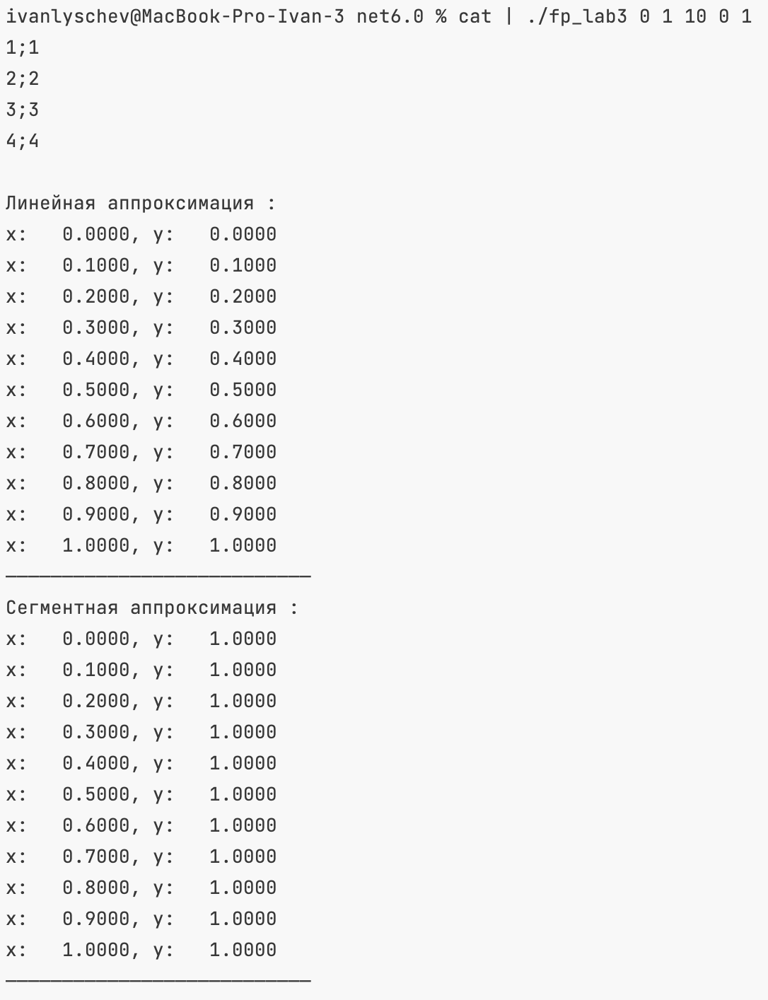

# Функциональное программирование
## Лабораторная работа 3

**Выполнил:** Лыщев Иван Антонович \
**Группа:** P34112 \
**Преподаватель:** Пенской Александр Владимирович

### Реализация
Функция читает из стандартного потока пока не будет пустая строка. 
В результате получаем список пар (x,y) 
```f#
let handleInput =
    let points = List.Empty

    let rec handler pList =
        let line = Console.ReadLine()

        if (not (isNull line) && line <> "") then
            let data = line.Split(";")

            if data.Length >= 2 then
                let x = double data[0]
                let y = double data[1]

                handler (
                    match pList with
                    | [] -> [ (x, y) ]
                    | _ -> (x, y) :: pList
                )
            else
                handler pList
        else
            pList

    handler points
```
В зависимости от аргументов командной строки, выбирается аппроксимирующая функция
```f#
let getFunc (funcId: string) points : double -> double =
    match funcId with
    | "0" -> linear points
    | "1" -> segment points
    | "2" -> logarifm points
    | _ -> linear points
```
Аппроксимация линейной функции. 
```f#
let linear points : double -> double =
    let sx = List.fold (fun state (x, _) -> state + x) 0. points
    let sxx = List.fold (fun state (x, _) -> state + x * x) 0. points
    let sy = List.fold (fun state (_, y) -> state + y) 0. points
    let sxy = List.fold (fun state (x, y) -> state + x * y) 0. points
    let n = points.Length
    let a = (sxy * (double n) - sx * sy) / (sxx * (double n) - sx * sx)
    let b = (sxx * sy - sx * sxy) / (sxx * (double n) - sx * sx)
    let f x = a * x + b
    f
```
Аппроксимация отрезками.
```f#
let segment (points: list<double * double>) : double -> double =
    let rec findBottomBorder i v =
        if i < points.Length then
            let x, _ = points[i]
            if x < v then i else findBottomBorder (i + 1) v
        else
            -1

    let rec findTopBorder i v =
        if i >= 0 then
            let x, _ = points[i]
            if x >= v then i else findTopBorder (i - 1) v
        else
            -1

    let f x =
        let top = findTopBorder (points.Length - 1) x
        let bottom = findBottomBorder 0 x

        if top = -1 then
            let _, yi = points[0]
            yi
        else if bottom = -1 then
            let _, yi = points[points.Length - 1]
            yi
        else
            let xi, yi = points[top]
            let xiPrev, yiPrev = points[bottom]
            let a = (yi - yiPrev) / (xi - xiPrev)
            let b = yi - a * xi
            a * x + b

    f
```
Аппроксимация логарифма 
```f#
let logarifm (points: list<double * double>) : double -> double =
    let sx = List.fold (fun state (x, _) -> state + log x) 0. points
    let sxx = List.fold (fun state (x, _) -> state + (log x) * (log x)) 0. points
    let sy = List.fold (fun state (_, y) -> state + y) 0. points
    let sxy = List.fold (fun state (x, y) -> state + (log x) * y) 0. points
    let n = points.Length
    let delta = sxx * (double n) - (sx * sx)
    let delta1 = sxy * (double n) - (sx * sy)
    let delta2 = sxx * sy - (sx * sxy)
    let a = delta1 / delta
    let b = delta2 / delta
    let f x = a * log x + b
    f
```
Генератор точек. a, b и n передаются аргументами при запуске.
```f#
let getPointGen (a: double) (b: double) (n: int) =
    let mult = (b - a) / (double n)
    let getPoint (i: int) = a + (double i) * mult
    getPoint
```
В результате имеем функцию f(x) = y. Передаем её с генератором в функцию вывода.
```f#
let printValues (f: double -> double) (pointGen: int -> double) count =
    [ 0..count ]
    |> List.map (fun i -> printfn $"x: %8.4f{pointGen i}, y: %8.4f{f (pointGen i)}")
    |> ignore
    ()
```
### Использование
Исходные данные в файле input \
 \
Входные файлы передаются на std нашей программы и выводится результат для аппроксимации 10 точек от 1 до 6 функцией 2 (logarifm)\
 \
Пример для использования 2х функции сразу (отрезки и логарифм) \
 

### Выводы 
В ходе выполнения лабораторной работы я не столкнуся с критическими для меня проблемами. 
Одим из разочаровывающих моментов было невозможность передать список в аргументах для теста. Поэтому они менее универсальны  

